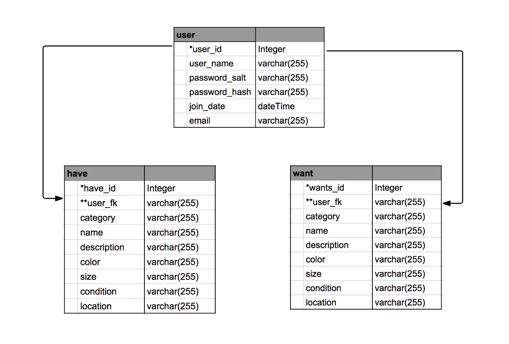

# WishList
WDI project #2 / WishList

Concept:
Wishlist is a site you go to to make your wishes come true.  It allows you to create a list of 'wants' and 'haves' and the platforms return a hit to the items on your 'want' list, if the attributes you describe matches for an item on the list matches an item from another users 'have' list.  Instead of wasting your time scouring for a specific item, just set up your want list and have it come to you!

Stakeholders = developers & GA instructors

### User Stories

**High Priority: (required project scope)**
* I need a way to login to the site
* I need to create my list of wants
* I need to create my list of haves
* I need to be able to edit and delete items off my list of haves and wants.

**Medium Priority:**
* I want to delete matches if it's not really want I'm looking for
* I want to be able to add more attributes to refine my wants and haves
* I need see a list of potential matches
* I need a way to connect to my match

**Low Priority:**
* I want to be able to refine my search query to a specific geographic area
* I would like a way to reduce error by handling exceptions (i.e. bicycle != bike)
* I would like to add photos to the items on my list

**Wireframe**

**Models**

