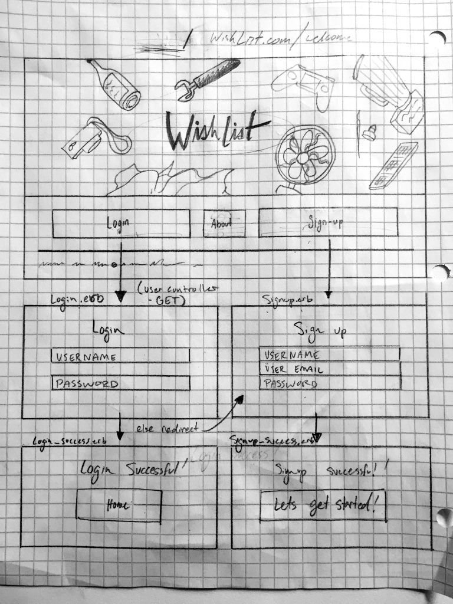
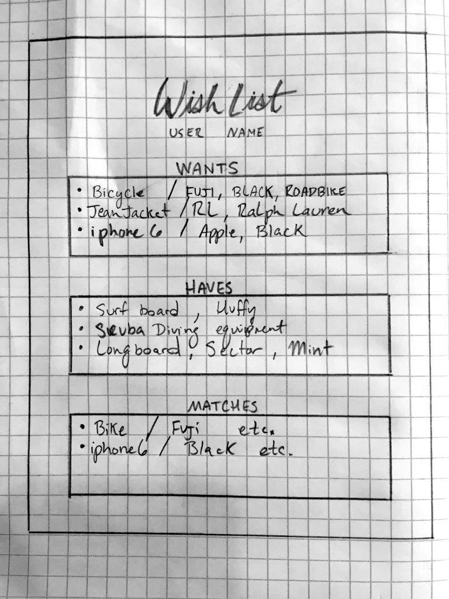

# WishList
WDI project #2 / WishList

Concept:
WishList is a web application that matches users wants and haves with other users haves and wants. WishList allows users to create a list of 'wants' and 'haves'. The user creates these items and applies a category and a list of attributes to the items. If the users items attributes matches a different users items attributes, that item is placed in the match section of the users involved.

Stakeholders = Chris Kim, Tristan Marshall & GA instructors

*Note the "WishList" logo (red logo in header) was illustrated & vectorized by Tristan Marshall*

## Technologies used in creating this application:

* HTML5
* CSS
* JavaScript
* jQuery
* Sinatra
* Active Record
* Inkscape
* SQL
* Ruby
* PostgreSQL
* Bootstrap

#### How to install and run
* Clone this repository.
* Navigate to the directory it is stored in.
* bundle the Gemfile
* Rub the migration.sql file in Postgres to generate the required databases.
* Run "bundle exec rackup" in your terminal
* Browse to localhost:9292

### User Stories

**High Priority: (required project scope)**
* I need a way to login to the site
* I need to create my list of wants
* I need to create my list of haves
* I need to be able to edit and delete items off my list of haves and wants.

**Medium Priority:**
* I want to delete matches if it's not really what I'm looking for
* I want to be able to add more attributes to refine my wants and haves
* I need see a list of potential matches
* I need a way to connect to my match

**Low Priority:**
* I want to be able to refine my search query to a specific geographic area
* I would like a way to reduce error by handling exceptions (i.e. bicycle != bike)
* I would like to add photos to the items on my list

**Wireframe**

